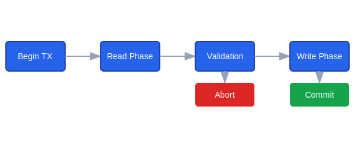

# Maemio: High-Performance In-Memory Database


## Overview

Maemio is a cutting-edge, high-throughput transactional database system built in Rust, implementing innovative design principles for exceptional performance and reliability. Inspired by the Cicada research paper, Maemio delivers a robust in-memory key-value store with advanced concurrency control.

## System Architecture


*Architectural overview of Maemio's multi-layered database design*

## Transaction Flow



*Visualization of Maemio's transaction processing steps*

## Key Features

- 🚀 **Multi-Version Concurrency Control (MVCC)**
  - Optimistic concurrency with best-effort version inlining
  - Minimizes conflicts and improves read performance

- ⏰ **Distributed Clock Design**
  - Scalable timestamp allocation
  - Enables millions of transactions per second

- 🔄 **Intelligent Contention Management**
  - Adaptive backoff with hill climbing algorithm
  - Automatically optimizes throughput under varying load conditions

- 💾 **Efficient Memory Usage**
  - Rapid garbage collection
  - Best-effort inlining
  - Minimal memory footprint

## Tech Stack


## Performance Benchmarks


## Getting Started

### Prerequisites

- Rust 1.65+ 
- 16GB+ RAM recommended

### Installation

```bash
# Clone the repository
git clone https://github.com/yourusername/maemio.git

# Build the project
cargo build --release

# Run tests
cargo test
```

### Quick Example

```rust
// Initialize database with custom configuration
let config = MaemioConfig {
    thread_count: 4,
    gc_interval: 20,
    clock_sync_interval: 200,
    initial_index_capacity: 2048,
};

let db = Maemio::with_config(config)?;
db.start_maintenance()?;

// Create and use the database...
```

## Adding Images to Your README

To add images to this README, follow these steps:

1. Create an `images/` directory in your repository root
2. Add your image files:
   - `logo.png`: Project logo
   - `architecture.svg`: System architecture diagram
   - `transaction-flow.svg`: Transaction processing flow
   - `performance-benchmark.png`: Performance metrics visualization

### Image Guidelines

- Use SVG for diagrams and illustrations
- Use PNG for logos and screenshots
- Optimize images for web (compress without losing quality)
- Ensure images are clear and readable

### Recommended Image Sizes

- Logo: 200-400 pixels wide
- Diagrams: 800-1200 pixels wide
- Screenshots: Depends on content, but keep under 1200 pixels wide

## Roadmap

- [ ] Add SQL layer support
- [ ] Implement join operations
- [ ] Develop schema management
- [ ] Create comprehensive documentation
- [ ] Develop performance benchmarking suite

## Contributing

1. Fork the repository
2. Create your feature branch (`git checkout -b feature/AmazingFeature`)
3. Commit your changes (`git commit -m 'Add some AmazingFeature'`)
4. Push to the branch (`git push origin feature/AmazingFeature`)
5. Open a Pull Request

### Image Contribution

When adding images:
- Use descriptive file names
- Optimize image file size
- Provide alt text for accessibility

## License

Distributed under the MIT License. See `LICENSE` for more information.

## Contact

Your Name - [@your_twitter](https://twitter.com/your_twitter)

Project Link: [https://github.com/yourusername/maemio](https://github.com/yourusername/maemio)
